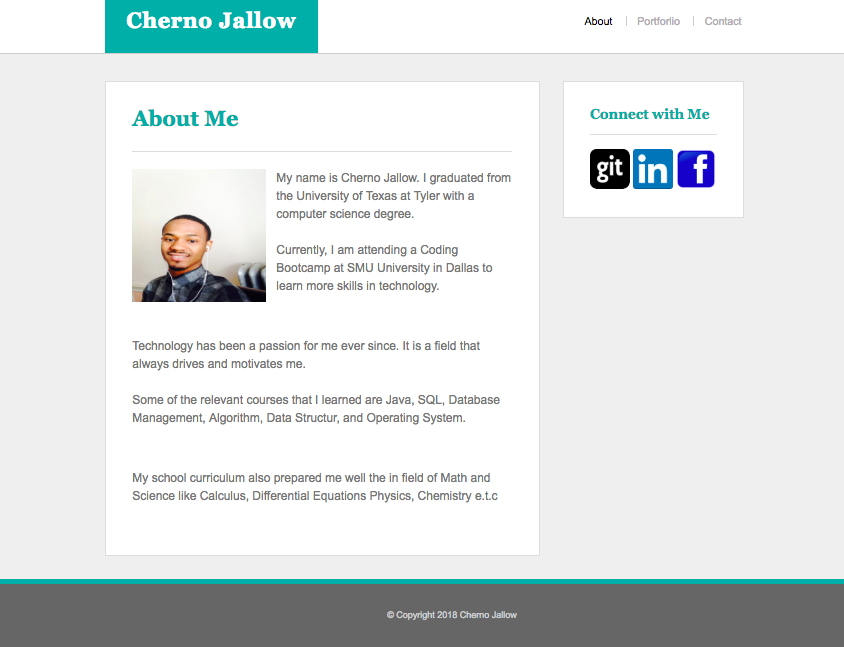
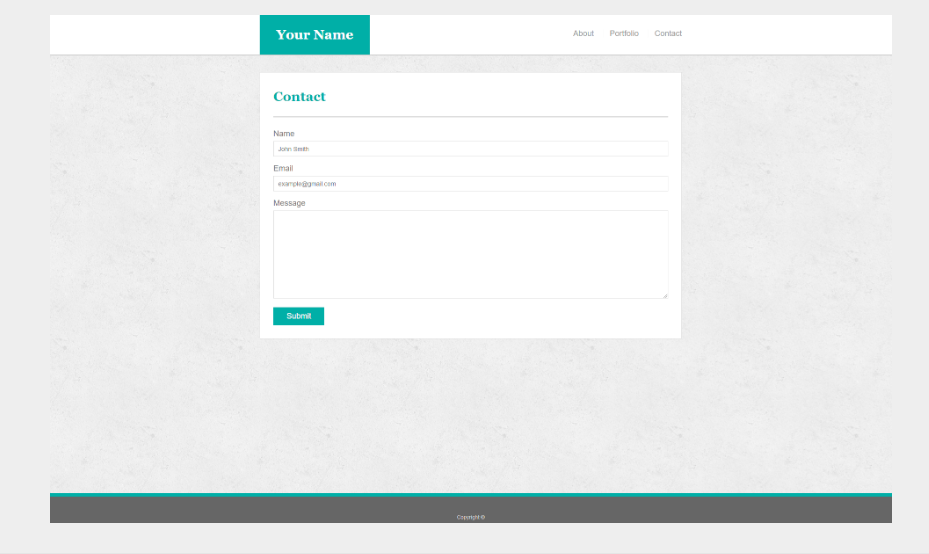

# Basic-Portfolio

# Recommended Assignment - That Portfolio Though

 # Overview

# Technologies used: HTML and CSS

Website deployed to Heroku :[Cherno-website!](https://cherno-website.herokuapp.com/) 

In this assignment, you'll build a professional portfolio site using HTML/CSS. These instructions include a short style guide; follow it to design an aesthetically pleasing layout while creating different kinds of complex HTML elements.

# Before You Begin

Welcome to your first opportunity as a front-end web designer. You will be advocating for your most important client—yourself! By making a portfolio, you'll take your first step toward building your web development brand.
This will be one of your harder assignments, if only because you're just getting your feet wet in web design. Trust us, though; it will get easier. Invest your time in this assignment, and it will pay dividends!

Submission on BCS

Please submit the link to the Github Repository!

 # Instructions

1.Create a new repository in GitHub called Basic-Portfolio.
2.Clone this repository to your computer using the process we went over in class.
3.Navigate to the Basic-Portfolio folder that you just cloned onto your machine. Inside this folder, create the following:
  
  -3 HTML documents: index.html, contact.html and portfolio.html.
  -A folder called assets.
  -Inside the assets directory, make two additional folders: css and images.
  -In the css folder, make a file called style.css.
  -In the css folder, make a file called reset.css, and include the code found from the Meyerweb reset located here.
  -In the images folder, save the images you plan on using (like your profile image and the placeholder images for the 
   portfolio

4.Push the above changes to GitHub.

  -Make sure to git add . and git commit -m "initial site files". Then type git push origin master to push your changes to
   your repo.
   
5.Reference these screenshots for your site:

     # About
     
   
   
     #Contact
   
    
    # Porforlio
    

